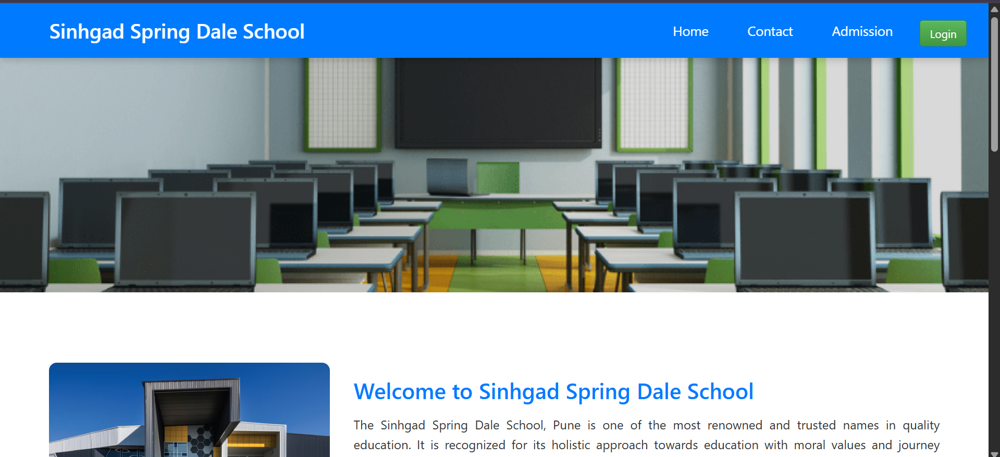
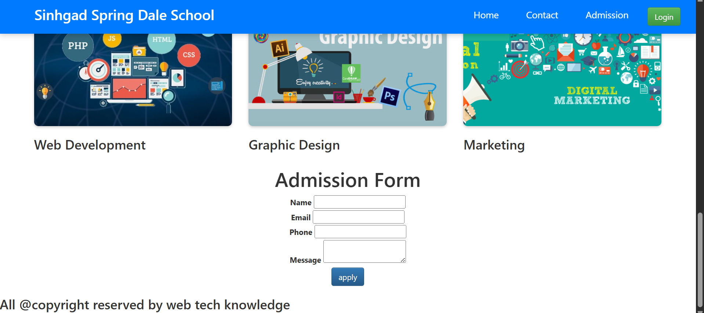
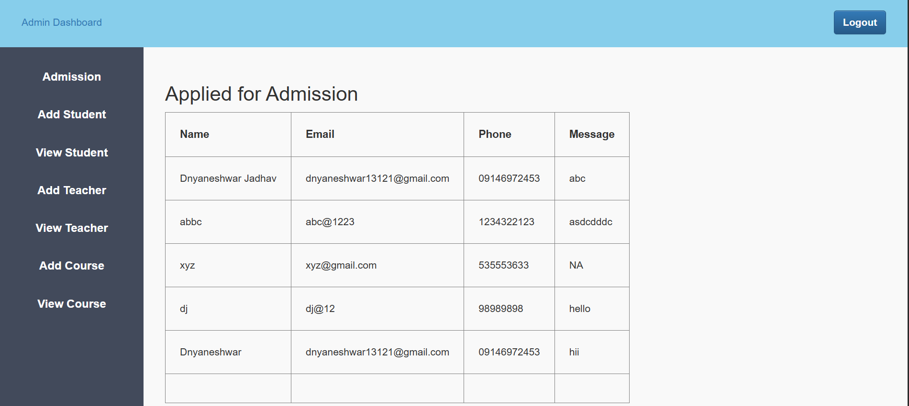
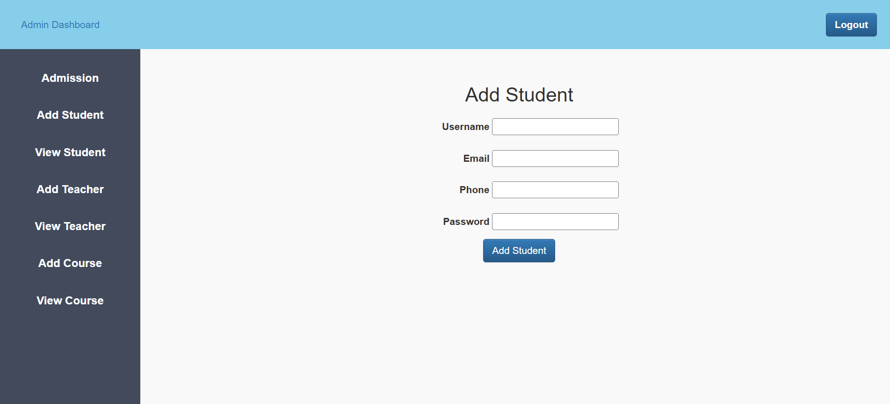
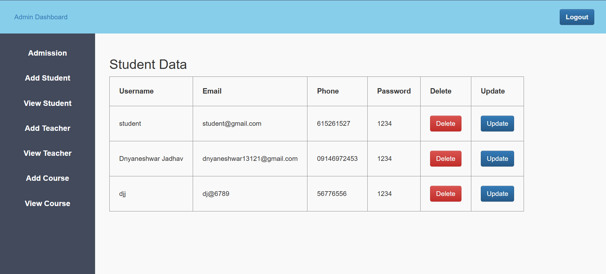
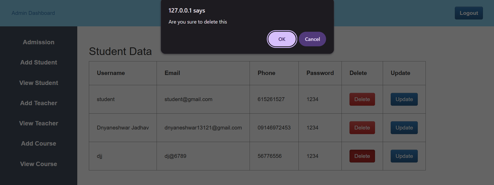
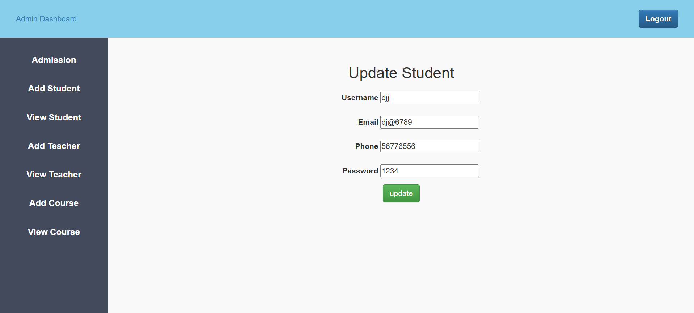

# 📚 School Management System

A simple **School Management System** that provides basic functionality for student and admin login, along with CRUD operations for student data.  
This project is built using **HTML, CSS, JavaScript, Bootstrap, PHP, and MySQL** and runs on XAMPP.

---

## ✨ Features

- 🔐 **Login System**
  - Admin Login
  - Student Login
- 🧑‍🎓 **Student Management**
  - Add Student Data
  - Update Student Data
  - Delete Student Data
  - View Student Data
- 💾 **Database Integration**
  - Data stored in **MySQL** using **phpMyAdmin**

---

## 🛠️ Tech Stack

- **Frontend:** HTML, CSS, JavaScript, Bootstrap
- **Backend:** PHP
- **Database:** MySQL (phpMyAdmin)
- **Server:** XAMPP (Apache & MySQL)

---

## Screenshot

## 📧 Contact
**Dnyaneshwar Jadhav** – [dnyaneshwar13121@gmail.com] 
GitHub: [dnyanu413](https://github.com/dnyanu413)

